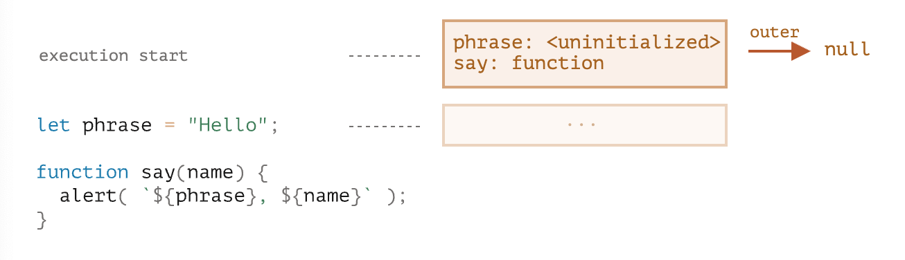

# 코어 자바스크립트

## 함수 심화학습

### 재귀와 스택

- 반복적인 사고와 재귀적인 사고
  - `x ** n` == `pow(x, n)`
```javascript
// 반복적인 사고
function pow(x, n) {
  let result = 1
  
  for (let i = 0; i < n; i ++) {
    result *= x
  }

  return result
}

// 재귀적인 사고
function pow(x, n) {
  if (n == 1) {
    return x
  }

  return x * pow(x, n - 1)
}
```
- 자바스크립트 엔진은 최대 재귀 깊이를 제한
  - **10,000**까지는 확실히 허용 (엔진에 따라 상이)
  - 간단한 경우에 위 제한을 완화하기 위해 **tail call optimization**[^1] 최적화 수행
  - `return` 에서 연산자 사용하면 최적화 불가능
  - 삼항 연산자(`? :`)는 콜스택에 메모리가 잡히지 않는 연산자
```javascript
// 최적화 가능
function factorial(x, acc = 1) {
  return (x <= 1 ? acc : factorial(x - 1, x * acc))
}

// 최적화 불가능
function factorial = (x) => {
  return ( x <= 0 ? 1 : x * factorial(x - 1))
}
```
- 실행 중인 함수의 실행 절차에 대한 정보는 해당 함수의 실행 컨텍스트(**Execution Context**) 에 저장
  - 함수 1 : 1 실행 컨텍스트 

### 나머지 매개변수와 스프레드 문법

- `...args` 변수는 항상 마지막 선언
- 유사 배열은 `arguments`를 사용해 매개변수에 접근 가능
  - 함수의 매개변수에 변수를 선언지 않아도 접근 가능
  - 화살표 함수(`() => {}`)는 `arguments`를 지원하지 않음
```javascript
function hello() {
  console.log(arguments[0], arguments[1])
}

hello('Hello', 'World') // 'HelloWorld'
```
- 스프레드 문법은 내부에서 이터레이터를 사용해 요소를 수집 → 이터러블 요소만 스프레드 문법 사용 가능

### 변수의 유효범위와 클로저

- `let`, `const` 블록 스코프

#### Lexical Environment[^2]

- 렉시컬 환경의 초기 상태
  - 표현식은 `let say = function() {...}` 해당하지 않음   
  
- 변수 접근 시 : **내부 렉시컬 환경**(현재 실행 중인 함수) → **외부 렉시컬 환경**(현재 실행 중인 함수를 호출한 함수)
- 클로저 : **외부 변수를 기억**하고 이 외부 변수를 접근할 수 있는 함수
  - 함수 종료 시 렉시컬 환경은 가비지 컬렉션에 의해 메로리 해제
  - 호출 종료 후 렉시컬 환경 내 선언된 변수에 접근 가능한 중첩 함수가 **클로저**

### 오래된 'var'

- 블록 스코프가 없음
- **전역 스코프** 이거나 **함수 스코프**
- `var foo; var foo;` 중복 선언 가능
- 변수 선언이 호이스팅이 발생해 선언 전 사용 가능
  - 단, 값의 할당은 호이스팅이 발생하지 않음 `→ undefined`
```javascript
(function(){
  // 즉시 실행 함수
  var foo = 'bar'
})()
```

### 전역 객체

- 브라우저 : `window`, Node.js : `global`
  - `globalThis`로 표준화 하자(?)
- `var foo`로 선언하면 전역 객체의 프로퍼티처럼 사용 가능
  - `window.foo`, `global.foo`
- 기명 함수 표현식
```javascript
const hello = function hell() {
  hell() // 내부 렉시컬 환경에서 자기 자신을 호출
  hello() // 내부 렉시컬 환경 밖의 변수인 hello에 접근해 오류
}
```


[^1]: https://velog.io/@yesdoing/%EA%BC%AC%EB%A6%AC-%EB%AC%BC%EA%B8%B0-%EC%B5%9C%EC%A0%81%ED%99%94Tail-Call-Optimization%EB%9E%80-2yjnslo7sr
[^2]: https://ko.javascript.info/closure#ref-351
