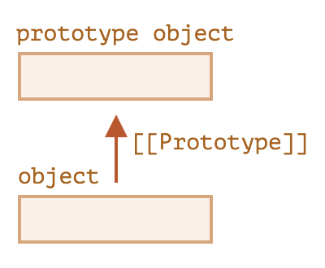

# 코어 자바스크립트

## 프로토타입과 프로토타입 상속

### 프로토타입 상속



> 메서드를 객체에서 호출했든 프로토타입에서 호출했든 상관없이 this는 언제나 . 앞에 있는 객체입니다.

- 숨김 프로퍼티 `[[Prototype]] {null | object}`
- 프로토타입 체이닝 : `object` 에 없는 속성은 `[[Prototype]]` 에서 찾기 위해 참조 방문
- `__proto__` : `[[Prototype]]` 의 **getter**, **setter**
  - ex) `animal.__proto__`
- 프로토타입 체이닝의 두 가지 제약사항 존재
  - 순환 참조 불가
  - `__proto__ {null | object}`
- 프로토타입은 프로퍼티를 읽을 때만 사용
  - **setter** 호출 시점의 `this`가 달라 우선 참조하는 프로퍼티가 다를 가능성 있음
- `for...in` 반복문에서 상속 프로퍼티도 순회
  - `object.hsOwnProperty(key)` 사용 시 상속 프로퍼티 제외 가능

### 함수의 prototype 프로퍼티

> 생성자 함수(F)의 프로토타입을 의미하는 F.prototype에서 "prototype"은 F에 정의된 일반 프로퍼티라는 점에 주의

- `new` 연산자를 사용해 만든 객체는 함수의 프로토타입 정보를 사용해 `[[Prototype]]` 설정
```javascript
function F() {}

const f = new F() // f.__proto__ = F.prototype
```
- `F.prototype` 변경 시 이후 `new F()` 객체는 변경된 `F.prototype` 을 갖지만 기존 객체는 변경 전 `F.prototype` 을 유지
- 함수의 `F` 의 디폴트 prototype : `{ constructor: F }

### 내장 객체의 프로토타입

- 명세 : 모든 내장 프로토타입 상속의 마지막은 `Object.prototype`
- 네이티브 프로토타입 변경은 좋지 않은 방법
  - 단, 자바스크립트 엔진에 해당 기능이 없는 경우 폴리필을 위해 네이비트 프로토타입 변경 가능
  ```javascript
  if (!String.prototype.repea) {
    // 폴리필
  }
  ```

### 프로토타입 메서드와 __proto__가 없는 객체

> 속도가 중요하다면 기존 객체의 `[[Prototype]]` 변경하지 않을 것

- `__proto__` 는 구식...
  - `Object.getPrototypeOf(object)`
  - `Object.setPrototypeOf(object, proto)`
  - `Object.create(proto, [descriptors])` : `[[Prototype]]` → `proto` 빈 객체
    - `for...in` 사용한 듯 완전한 복사
      - 열거 가능한 프로퍼티,
      - 열거 불가능한 프로퍼티,
      - 데이터 프로퍼티
      - getter·setter
      - `[[Prototype]]` 등 모든 프로퍼티

## 클래스

> Synctatics sugar

### 클래스와 기본 문법

```javascript
class Animal {
  name = 'animal' /* 필드 (this.name) */

  constructor() { /* 생성자 */ }
  get method() { /* 메서드 */ }
  set method() { /* 메서드 */ }
  ['say' + 'Hello']() { /* 계산된 메서드 */ }
}

const animal = new Animal()
const animal = class /* Animal */ {
  constructor()
  method()
}
```

- `class Animal {}`
  - `Animal` 이름을 갖는 함수 생성 `typeof Animal === function`
  - `Animal` 함수의 본문은 `constructor()`, 없다면 본문이 빈 함수 생성 `Animal.prototype.constructor === Animal`
  - 클래스 내 정의한 `method()` 는 `Animal.prototype` 에 저장 `Animal.prototype.method`
- `class` 생성 함수는 `[[IsClassConstructor]]: true`
- `class` 생성 함수의 메서드는 열거 불가
- `class` 는 항상 `strict` 모드

### 클래스 상속

```javascript
class Rabbit extends Animal {
  constructor() {
    super() /* 부모 클래스 constructor 호출 */
    /* 생성자 */
  }
  method() {
    super.method() /* 부모 클래스 method 호출 */
  }
}
```

- `extends` 는 `Rabbit.prototype.[[Prototype]]` 을 `Animal.prototype` 으로 설정
- 화살표 함수에는 `super` 가 없음
