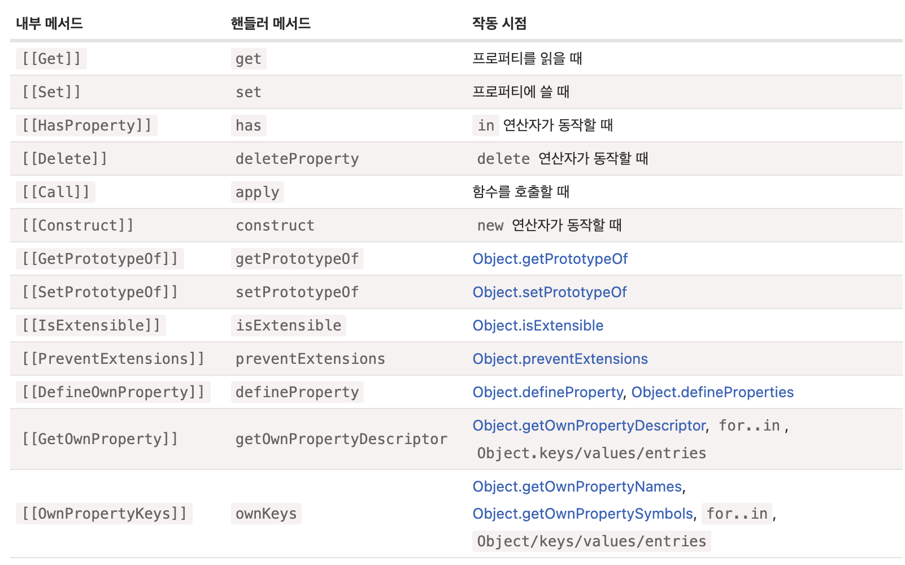

# 코어 자바스크립트

## 모듈

### 모듈 소개

- AMD[^1] : 가장 오래된 모듈 시스템(require.js)
- CommonJS[^2] : Node.js 서버를 위한 모듈 시스템
- UMD[^3] : AMD, CommonJS 등 함께 사용하기 위해 만들어짐
> 역사로 사라져..
> 2015년 모듈 시스템이 표준으로 등재
- `export`, `import` 키워드로 통해 모듈 호출
```javascript title="test"
export function talk() {}
```
```html
<script type="module">
  import {talk} from './talk.js'
</script>
```
- `file://` 프로토콜은 모듈 시스템 동작하지 않음, `HTTP`, `HTTPS` 프로토콜을 통해 모듈 시스템 동작
- 모듈은 항상 `엄격 모드(use strict)` 환경으로 실행
- 모듈은 단독 스코프를 생성
  - `export`, `import` 를 사용하는 이유
- 모듈은 여러번 호출 시 **단, 한 번만 실행**
  - **다른 모듈에서 사용 시 이 결과를 반환**
- `import.meta` : 현재 모듈에 대한 정보 제공(호스트에 따라 다름)
- 모듈의 최상위 `this === undefined`
- 모듈은 브라우저에서 항상 지연 실행(`defer`)
  - HTML 처리 중단 없이 병렬적으로 다운로드
  - **HTML 완전히 준비될 떄까지 대기** 후 실행
  - 스크립트의 상대적 순서 유지
- 인라인 스크립트의 `async` 처리는 모듈만 가능
  - `async` 는 HTML 처리를 기다리지 않고 실행
```javascript
<script async type="module"></script>
<script async type="module" src=""></script>
<script async src=""></script>
<script nomodule></script>
```

#### 빌드 툴

> Webpack 등 번들링

- 번들링이 모듈을 사용하는 것!
  - `<script type="module">` 의 진입점 `main.js` 을 시작으로...
  - 결과는 모듈이 아닌 일반 스크립트화

### 모듈 내보내고 가져오기

- `import *`로 한 번에 불러오는 것보다 구체적으로 명시하는 것이 성능에 이점
  - 번들링 최적화(트리쉐이킹) 시 미사용 모듈 제거를 위함
```javascript
import * as foo from ''
import {foo as bar} from ''
import {default as foo} from ''
export {foo as bar} from ''
export {foo as default} from ''
export {foo, default as bar} from ''
export * from '' // default export는 무시, named export만 export
```

### 동적으로 모듈 가져오기

```javascript
import('PATH')
  .then()
  .catch()
await import('PATH')
```
- 동적 `import`는 `type="module"` 없는 일반 스크립트에서도 가능
- 함수 호출과 달라 `call/apply` 사용 불가능

## 기타

### Proxy와 Reflect

```javascript
const proxy = new Proxy(target, handler = {
  get(target, property, reciever) { return false || true},
  set(target, property, value, reciever) { return false || true},
})
```
- `Proxy`는 특정 객체를 감싸 작업을 가로채
- `Proxy`는 프로퍼티가 없음, `handler`가 없으면 `target`에 직접 전달, 기능 손상이 없음
- `Proxy` 사용 이후 `target` 직접 참조는 없도록

- `Reflect` 상속 받은 경우 `target`을 자기 자신으로 하는...!?

### Eval

**Eval is Evil.**

### 커링

```javascript
func(foo)(bar)(min)(goo)
```

### 참조 타입

```javascript
const foo = foo.bar()
foo() // { this === undefined }

(foo, 'bar', true)() // { this === foo }
```
- `obj.method()`
  - `.` 는 `obj.method` 에 접근
  - `()` 메서드 실행


### BigInt

- `BigInt(10) === 10n`

[^1]: https://en.wikipedia.org/wiki/Asynchronous_module_definition
[^2]: http://wiki.commonjs.org/wiki/Modules/1.1
[^3]: https://github.com/umdjs/umd
[^4]: https://en.wikipedia.org/wiki/Currying