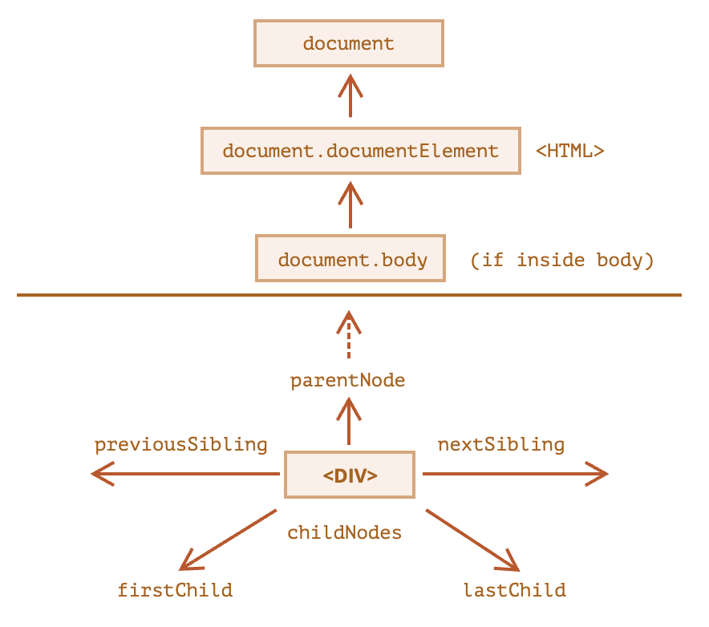
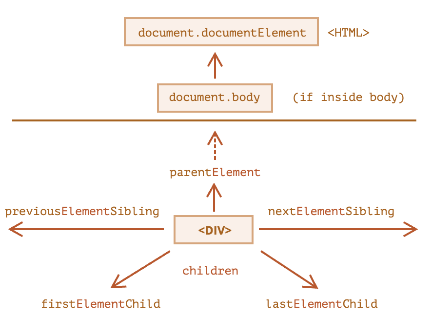
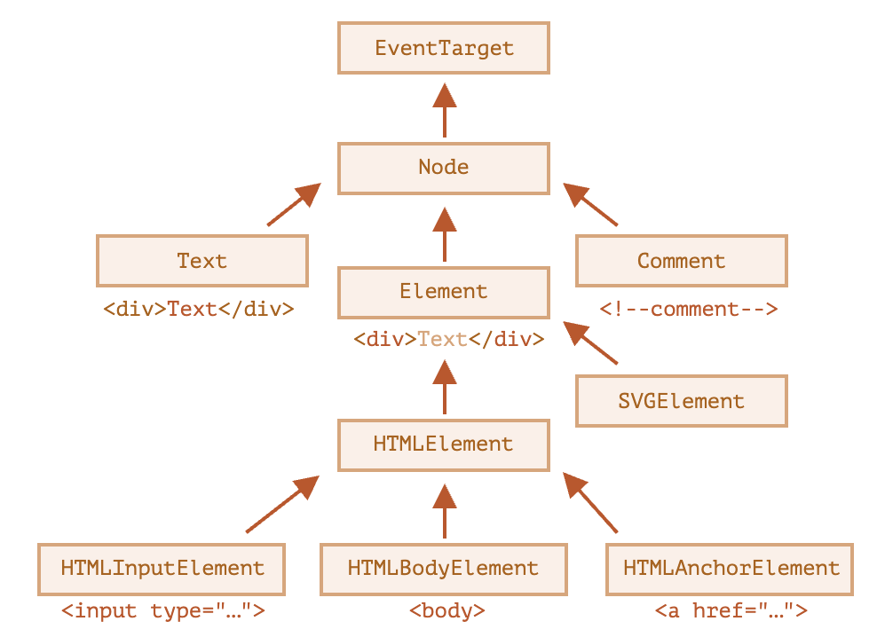

# 브라우저: 문서, 이벤트, 인터페이스

## 문서

### 브라우저 환경과 다양한 명세서

> window   
> ㄴ DOM - document ...   
> ㄴ BOM - navigator, screen, location, frames, history, XMLHttpRequest   
> ㄴ JavsScript - Object, Array, Function ...

- 최상위(루트) `window` 객체
  - 자바스크립트의 **전역 객체**
  - 브라우저를 제어할 수 있는 메서드 제공

#### 문서 객체 모델 (Document Object Model; DOM)

- 웹 페이지 내 모든 콘텐츠를 객체로 표현하는 모델
- `document` 객체는 페이지의 **진입점(루트)** 

> 브라우저 만을 위한 모델이 아니라 HTML 페이지를 사용하는 서버 사이드에서도 DOM 사용 <small>*명세의 일부만 사용</small>

#### CSS 객체 모델 (CSSOM)[^1]

- CSS 규칙과 스타일시트를 객체로 표현한 모델

#### 브라우저 객체 모델 (Browser Object Model; BOM)

- 문서 이외의 것을 제어하기 위해 브라우저가 제공하는 모델

### DOM 트리

- HTML을 이루는 태그는 객체, 태그 내 문자도 객체(`#text`), 주석도 객체(`#comment`) 이를 통틀어 노드
- 노드의 타입은 총 열두 가지[^2]
- `<head>` 이전의 공백과 새 줄은 무시
- 모든 콘텐츠는 `<body>` 내부에 선언
  - 외부에 선언해도 내부에 선언한 것으로 평가
- 문자열의 양 끝 공백과 태그 사이 새 줄의 `#text`는 생략

[^1]: https://www.w3.org/TR/cssom-1/
[^2]: https://dom.spec.whatwg.org/#node

### DOM 탐색

#### DOM 컬렉션



- 브라우저가 `document.body`를 읽기 전에 접근 시 `null`
- DOM 컬렉션은 읽기 전용 프로퍼티
- `for..in` 사용 금지 : 불필요한 프로퍼티까지 순회

#### 요소 간 이동



- DOM 컬렉션과 다르게 텍스트, 주석 노드를 참색하지 않음
- **`document`는 요소 노드가 아니다**

### getElement*, querySelector*로 요소 검색하기

- `id` 전역 변수로 요소 접근하지 말 것!
- `id` 속성값 중복하지 말 것!
- `document.getELement*(querySelector*)` 로 요소를 찾을 것!
- `querySelector*` 는 가상 클래스도 사용 가능
- `el.matches` 는 `el`이 선택자와 일치하는 지 평가 
- `el.closest` 는 선택자와 일치하는 가까운 조상 탐색 
- `getElementsBy*` 는 동적인 컬렉션 반환(변경 시 갱신)
  - `querySelctor*` 는 정적인 컬렉션 반환(변경 시 갱신 x)

### 주요 노드 프로퍼티



- 계층의 끝에 `EventTarget`
- 각 태그는 `HTML*Element` 클래스

> console.log(el) : DOM 트리 출력
> console.dir(el) : el의 객체 출력 (쉬운 프로퍼티 확인)

- `tagName` 은 요소 노드에만 존재(`Element` 에서 유래 )
  - XML 모드 제외, 항상 대문자!
- `nodeName` 은 모든 노드에 존재
- `innerHTML+=` 는 모든 내용을 덮어 새로 로딩...
- `nodeValue`, `data` 프로퍼티로 텍스트 접근

### 속성과 프로퍼티

- 요소 노드에서 대부분의 표준 HTMl 속성은 DOM 객체의 프로퍼티
- 비표준 속성은 프로퍼티가 아니라 `hasAttribute`, `getArrtibute`, `setAttribute`, `removeAttribute` 사용
- 비표준 속성 dataset : `data-*` (el.dataset.*)

### 문서 수정하기

- `document.createElement(.createTextNode)`
- `node.append(.prepend | .before | .after | .replaceWidth)`
- `node.insertAdjacentHTML('beforebegin' | 'afterbegin' | 'beforeend' | 'afterend', html)`
- `node.remove`
- `node.clone(true_깊 | false_얕)`
- `DocumentFragment` 는 특별한 DOM 노드로 문서에 추가 시 하위 노드만 남고 사라져!
- `document.write` 는 페이지 불러오는 중에만 작동하기 때문에 사용하는 모습이 드물어..

### 스타일과 클래스

- `el.className`, `el.classList.add(.remove | .toggle | .contains)`
- `getComputedStyle(element, [pseudo])` 로 계산된 스타일
  - CSS 계산 값(computed) : 요소에 적용된 최종 (상대)값
  - CSS 결정 값(resolved) : 요소에 적용된 최종 (절대)값
  - `:visited` 링크 관련 속성은 숨김 처리

### 요소 사이즈와 스크롤

- CSS를 사용해 너비와 높이를 얻지 마라!
  - `box-sizing` 따라 다르다
  - `auto` 일 수 있다
  - 스크롤에 따라 다를 수 있다

### 브라우저 창 사이즈와 스크롤

- 스크롤 때문에 `document.clientWidth/clientHeight` 사용
- 문서 전체 높이는 아래 프로퍼티 중 최댓값을 사용
```javascript
let scrollHeight = Math.max(
  document.body.scrollHeight, document.documentElement.scrollHeight,
  document.body.offsetHeight, document.documentElement.offsetHeight,
  document.body.clientHeight, document.documentElement.clientHeight
)
```
- `window.pageXOffset/pageYOffset`
- `window.scrollBy/scrollTo`
- `el.scrollIntoView(true_맨위 | false_맨아래)`

### 좌표

- `el.getBoundingClientRect()`
