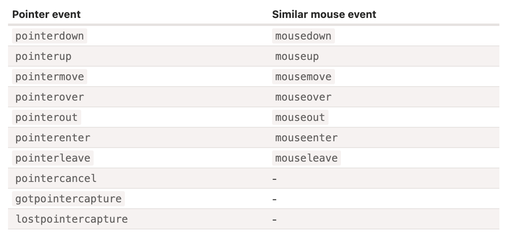

# 브라우저: 문서, 이벤트, 인터페이스

## UI 이벤트

### 마우스 이벤트

- `mousedown`·`mouseup`
- `mouseover`·`mouseout`
- `mousemove`
- `click`: `mousedown`·`mouseup` 연달아 발생할 때
- `dbclick`
- `contextmenu` : 마우스 오른쪽 버튼을 눌렀을 때
- `event.button` : {0, 1, 2, 3, 4}
- `event.shiftKey`
- `event.altKey`
- `event.ctrlKey`
- `event.metaKey` : `MacOS - Cmd`
- `clientX`, `clientY` : 문서 기준
- `pageX`, `pageY` : 브라우저 기준

### Moving the mouse: mouseover/out, mouseenter/leave

- `mouseover`
  - `event.taget` : 마우스가 들어온 `target`
  - `event.relatedTarget` : `target` 에 들어오기 전 `target`, 또는 `null`
- `mouseout`
  - `event.taget` : 마우스가 떠난 `target`
  - `event.relatedTarget` : `target` 을 떠나 새로운 `target`, 또는 `null`
- 마우스가 빠르게 움직이는 경우 `SKIP` 하는 요소도 있을 수 있음
- `mouseout` : 브라우저 로직에 따라 마우스는 최상위(`z-index`)에 있는 요소를 `target` 으로 한다 
- `moutover` : 이벤트 버블링이 발생해 전달
- `mouseenter`·`mouseleave` : 이벤트 버블링 발생하지 않음

### Pointer events

### Keyboard: keydown and keyup

- `Key: Z`, `event.key: z(lowercase)`, `event.code: KeyZ`
- `Key: Shift + Z`, `event.key: Z(uppercase)`, `event.code: KeyZ`
