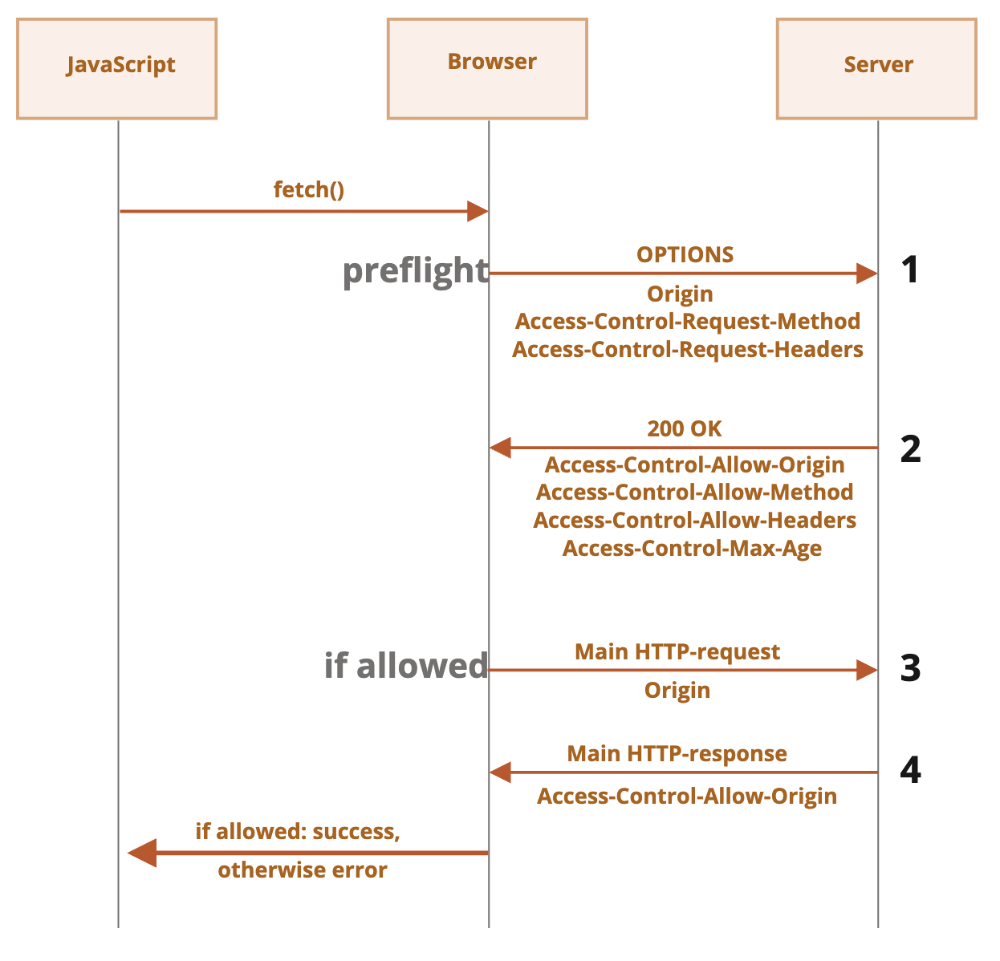

# 브라우저: 문서, 이벤트, 인터페이스

## 문서와 리소스 로딩

### DOMContentLoaded, load, beforeunload, unload 이벤트

- `DOMContentLoaded` : DOM 트리 완성 시 발생, 이미지·스타일시트는 기다리지 않음
- `load` : DOM 트리 완성, 이미지·스타일시트 로드 완료 시 발생
- `beforeunload/unload` : 페이지 떠날 떄 발생
- `<link rel="stylesheet />` 다음 `<script>` 는 스타일시트를 기다림
- fetch 메서드는 사용자가 떠난 후에도 요청이 계속되는 플래그 `keepalive` 보유 
- `document.readyState` : 현재 로딩 상태
  - `loading`: 문서 불러오는 중
  - `interactive` : 문서가 완전히 불러와졌을 때
  - `complete` : 문서 및 이미지 등 리소스 모두 불러와졌을 때

### defer, async 스크립트

- `defer` : 스크립트를 백그라운드에서 다운로드
  - 지연 스크립트를 다운로드하는 중에 HTML 파싱을 멈추지 않음
  - **페이지 구성이 끝날 때 까지 지연**
  - 일반 스크립트와 마찬가지로 HTML에 추가된 순으로 실행
  - 작은 스크립트가 먼저 다운되지만, 실행은 나중에
- `async` : 스크립트를 비동기 완적 독립적으로 다운로드
  - 비동기 스크립트를 다운로드하는 중에 HTML 파싱을 멈추지 않음
  - **비동기 스크립트 실행 중에 HTML 파싱 멈춤**
  - `DOMContentLoaded`와 `비동기 스크립트는 서로를 기다리지 않음
  - 스크립트 실행에 순서가 없음
  - 동적으로 추가한 스크립트는 항상 비동기 스크립트처럼 동작

### Resource loading: onload and onerror

#### CORS

- `crossorigin`[^1]
  - `Access-Control-Allow-Origin: *`
- `Cross-Origin Resource Sharing (CORS)`
- Cross-Origin Request : 도메인, 서브 도메인, 프로토콜, 포트가 다른 곳에 보내는 요청
- 아래 두 요건을 충족하지 않은 요청은 안전하지 않은 요청으로 평가

- 안전한 요청은 `<form>`, `<script>`를 사용해 요청 생성 가능
- 항상 `Origin` 헤더를 추가
  - `Origin: $PROTOCOL://$DOMAIN:PORT`


## 기타

### Mutation observer

### Selection and Range

### 이벤트 루프와 매크로·마이크로태스크

- 브라우저 자바스크립트와 Node.js는 **이벤트 루프**에 기반
- 이벤트 루프 : 태스크를 기다렸다가 들어오면 처리(반복)
- 태스크는 **매크로 태스트 큐**에서 기다림
- 엔진이 특정 태스크를 처리하는 동안 **렌더링이 절대 일어나지 않음**
- `코드` → `promise(마이크로 태스트)-.then` → `timout-setTimeout(매크로 태스크)`

```javascript
queueMicrotask(microtask)
```

[^1]: https://ko.javascript.info/fetch-crossorigin
