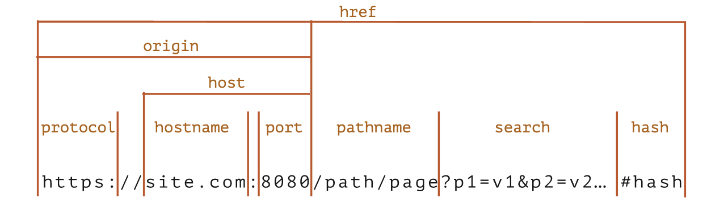

# 추가 주제

## 네트워크 요청

### fetch

```javascript
let promise = fetch(url, [
  {
    method: 'POST',
    headers: {
      'Content-Type': 'form/multipart'
    },
    body: new FormData(formElement),
  }])
  .then(response => response.text())
  .then(response => response.json())
  .then(response => response.blob())
  .then(response => response.arrayBuffer())
  .then(response => response.body)
  .then(result => result)

let src = URL.createObjectURL(blob)
```

- `POST` 요청을 보낼 때 본문이 문자열인 경우 `Content-Type: text/plain;charset=UTF-8` 이 default
  - 본문이 `JSON` 형태인 경우 `Content-Type: application/json` 으로 변경 필요
  - 본문이 `Blob` 형태인 경우 설정하지 않아도 OK
  - 본문이 이미지 형태인 경우 `Content-Type: image/*` 자동 설정

### FormData

```javascript
let formElement = document.getElementsByTagName('form')

let formData = new FormData(formElement)

formData.append(name, value)
formData.get(name)
formData.set(name, value)
formData.has(name)
formData.delete(name)
```

### Fetch: Download progress

- `response.body` 는 `ReadableStream`
```javascript
const reader = response.body.getReader()

let receiveLength = 0
let chunks = []

while(true) {
  /**
   * {boolean} done 다 읽었으면 true
   * {Uint8Array} value 바이트 배열
  */
  const { done, value } = await reader.read()

  if (done) {
    break
  }

  chunks.push(value)
  receivedLength += value.length
}

let chunksAll = new Uint8Array(receiveLength)
let position = 0
for (let chunk of chunks) {
  chunksAll.set(chunk, position)
  position += chunk.length
}

let result = new TextDecoder('utf-8').decode(chunksAll)
```
- `fetch` 로 업로드 진행상태를 확인할 방법이 없음
  - 필요한 경우 XMLHttpRequest 참고

### Fetch: Abort

- 비동기 작업을 abort 할 수 있는 `AbortController`
```javascript
let controller = new AbortController()
let signal = controller.signal

signal.addEventListener('abort', () => {})

controller.abort()
```
- `controller.abort()` 실행 시 `controller.signal` 에 `abort` 이벤트 발생 및 `controller.signal.aborted = true` 로 변경
```javascript
fetch(url, {
  signal: controller.signal, // `abort` 발생 시 fetch abort
})
```

### CORS

- Cross-Origin Resouce Sharing 정책
- `script` 태그는 도메인의 제약이 없음
  - CORS 피하는 트릭(?)
- 안전한 요청은 `<form>`, `<script>` 를 사용해 요청 생성 가능


#### 안전한 요청

아래 두 조건을 모두 충족하지 않으면 안전하지 않은 요청

1. 안전한 요청
  - 안전한 메서드 : `GET`, `POST`, `HEAD`
  - 안전한 헤더 : `Accept`, `Accept-Language`, `Content-Language`, `application/x-www-form-urlencoded`, `multippart/form-data`, `text/plain`, `Content-Type`
2. 안전한 요청이 아닌 요청

#### 안전한 응답 헤더

- CORS 요청이 발생한 경우 안전한 헤더에만 접근 가능
  - `Cache-Control`
  - `Content-Language`
  - `Expires`
  - `Last-Modified`
  - `Pragma`


### URL objects



```javascript
/**
 * {string} url URL 또는 path
 * {string} base 선택적 URL base
*/
let url = new URL(url, [base])

url.searchParams
  .append(name, value)
  .delete(name)
  .get(name)
  .getAll()
  .has(name)
  .set(name, value)
  .sort()
```

- `url`은 반드시 UTF-8 인코딩된 문자열
```javascript
encodeURI(decodedUrl)
decodeURI(encodedUrl)

let value = encodeURIComponent(decodedUrl)
let value = decodeURIComponent(encodedUrl)

let url = `...?key=${value}`
```

