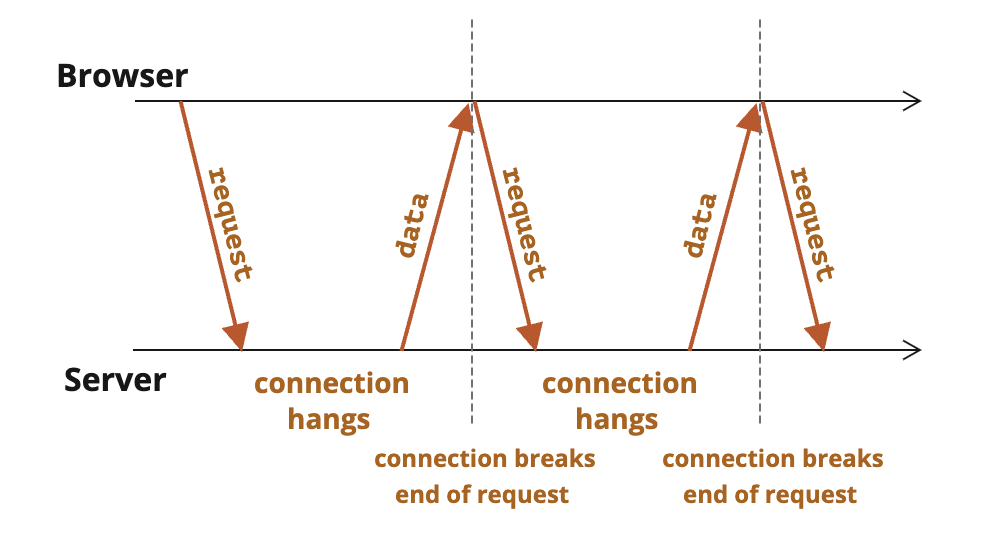
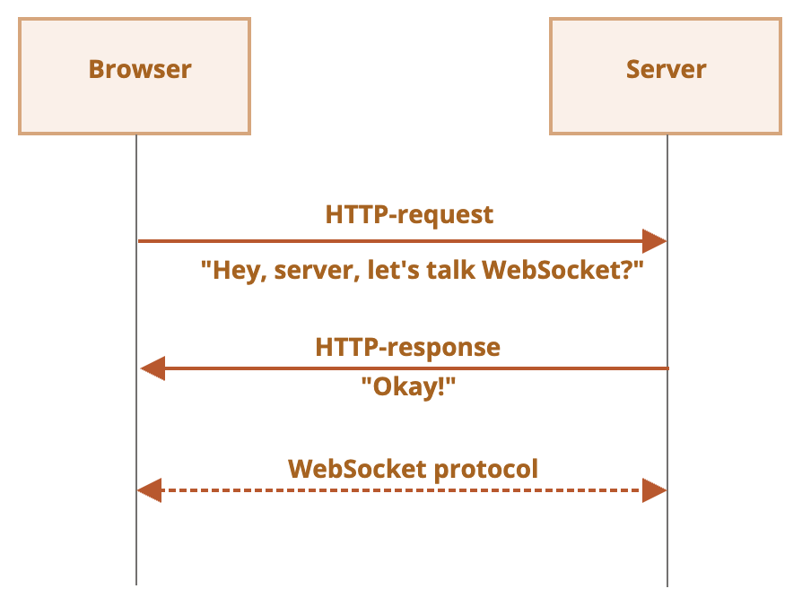

# 추가 주제

## 네트워크 요청

### fetch

```javascript
let promise = fetch(url, [
  {
    method: 'POST',
    headers: {
      'Content-Type': 'form/multipart'
    },
    body: new FormData(formElement),
  }])
  .then(response => response.text())
  .then(response => response.json())
  .then(response => response.blob())
  .then(response => response.arrayBuffer())
  .then(response => response.body)
  .then(result => result)

let src = URL.createObjectURL(blob)
```

- `POST` 요청을 보낼 때 본문이 문자열인 경우 `Content-Type: text/plain;charset=UTF-8` 이 default
  - 본문이 `JSON` 형태인 경우 `Content-Type: application/json` 으로 변경 필요
  - 본문이 `Blob` 형태인 경우 설정하지 않아도 OK
  - 본문이 이미지 형태인 경우 `Content-Type: image/*` 자동 설정

### FormData

```javascript
let formElement = document.getElementsByTagName('form')

let formData = new FormData(formElement)

formData.append(name, value)
formData.get(name)
formData.set(name, value)
formData.has(name)
formData.delete(name)
```

### Fetch: Download progress

- `response.body` 는 `ReadableStream`
```javascript
const reader = response.body.getReader()

let receiveLength = 0
let chunks = []

while(true) {
  /**
   * {boolean} done 다 읽었으면 true
   * {Uint8Array} value 바이트 배열
  */
  const { done, value } = await reader.read()

  if (done) {
    break
  }

  chunks.push(value)
  receivedLength += value.length
}

let chunksAll = new Uint8Array(receiveLength)
let position = 0
for (let chunk of chunks) {
  chunksAll.set(chunk, position)
  position += chunk.length
}

let result = new TextDecoder('utf-8').decode(chunksAll)
```
- `fetch` 로 업로드 진행상태를 확인할 방법이 없음
  - 필요한 경우 XMLHttpRequest 참고

### Fetch: Abort

- 비동기 작업을 abort 할 수 있는 `AbortController`
```javascript
let controller = new AbortController()
let signal = controller.signal

signal.addEventListener('abort', () => {})

controller.abort()
```
- `controller.abort()` 실행 시 `controller.signal` 에 `abort` 이벤트 발생 및 `controller.signal.aborted = true` 로 변경
```javascript
fetch(url, {
  signal: controller.signal, // `abort` 발생 시 fetch abort
})
```

### CORS

- Cross-Origin Resouce Sharing 정책
- `script` 태그는 도메인의 제약이 없음
  - CORS 피하는 트릭(?)
- 안전한 요청은 `<form>`, `<script>` 를 사용해 요청 생성 가능


#### 안전한 요청

아래 두 조건을 모두 충족하지 않으면 안전하지 않은 요청

1. 안전한 요청
  - 안전한 메서드 : `GET`, `POST`, `HEAD`
  - 안전한 헤더 : `Accept`, `Accept-Language`, `Content-Language`, `application/x-www-form-urlencoded`, `multippart/form-data`, `text/plain`, `Content-Type`
2. 안전한 요청이 아닌 요청

#### 안전한 응답 헤더

- CORS 요청이 발생한 경우 안전한 헤더에만 접근 가능
  - `Cache-Control`
  - `Content-Language`
  - `Expires`
  - `Last-Modified`
  - `Pragma`


### URL objects


```javascript
/**
 * {string} url URL 또는 path
 * {string} base 선택적 URL base
*/
let url = new URL(url, [base])

url.searchParams
  .append(name, value)
  .delete(name)
  .get(name)
  .getAll()
  .has(name)
  .set(name, value)
  .sort()
```

- `url`은 반드시 UTF-8 인코딩된 문자열
```javascript
encodeURI(decodedUrl)
decodeURI(encodedUrl)

let value = encodeURIComponent(decodedUrl)
let value = decodeURIComponent(encodedUrl)

let url = `...?key=${value}`
```

### XMLHttpRequest

- `XMLHttpRequest` : HTTP 요청을 위한 브라우저 built-in 객체
  - XML 뿐만 아니라 데이터도 처리 가능하며, 진행상태 추적 가능
- 동기·비동기 요청 모두 가능
```javascript
let xhr = new XMLHttpRequest()

// open 호출 시 HTTP 요청을 실행하지 않음
xhr.open(method, new URL(), [async, user, password])
// send 호출 시 HTTP 요청을 실행
xhr.send([body])
xhr.abort()

xhr.responseType = ''
// CORS policy
xhr.withCredentials = true

xhr.onreadystatechange = () => {
  if (xhr.readyState === 0) { /* UNSET : initial state */ }
  if (xhr.readyState === 1) { /* OPENED : open called*/ }
  if (xhr.readyState === 2) { /* HEADERS_RECEIVED : response headers received */ }
  if (xhr.readyState === 3) { /* LOADING : response is loading (a data packed is received) */ }
  if (xhr.readyState === 4) { /* DONE : request complete */ }
}
xhr.onload = () => {
  xhr.status
  xhr.statusText
  xhr.response.length
}
xhr.onerror = () => {}
xhr.onprogress = (event) => {
  event.lengthComputable
  event.loaded
  event.total
}

xhr.setRequestHeader(name, value)
xhr.getResponseHeader(name)
xhr.getAllResponseHeaders()

xhr.upload.onloadstart = () => {}
xhr.upload.onprogress = () => {}
xhr.upload.onabort = () => {}
xhr.upload.onerror = () => {}
xhr.upload.onload = () => {}
xhr.upload.ontimeout = () => {}
xhr.upload.onloadend = () => {}
```

### Long polling

- WebSocket, Server Side Events 를 사용하지 않고 서버와 영구적인 연결이 가능한 방법



#### Reegular Polling

- 일정한 주기를 두고 서버에 요청을 보내는 방법

### 웹소켓

- 데이터를 **패킷(packet)** 형태로 전달
- 커넥션 중단과 추가 HTTP 요청 없이 양방향 통신
- 커넥션을 위해 `ws` 프로토콜 사용 : 암호화 되지 않은 상태
  - `wss`(≈ `HTTPS`) 프로토콜 사용하자! : TSL(Transport Layer Security)을 통과해 송신자 측에서 데이터 암호화 및 수신자 측에서 복호화 → 프락시 서버는 패킷 확인 불가능
- 웹소켓 객체는 기본적으로 크로스 오리진 요청 지원

#### 데이터 전송

- 텍스트 프레임
- 이진 데이터 프레임
  - `WebSocket.send()` 는 텍스트/바이너리 데이터만 보낼 수 있다
- 핑/퐁 프레임
- 커넥션 종료 프레임 등


  
```javascript
let socket = new WebSocket('ws://javascript.com')

socket.onopen = () => {}
socket.onmessage = () => {}
socket.onerror = () => {}
socket.onclose = () => {}

socket.close([code], [reason])
```
